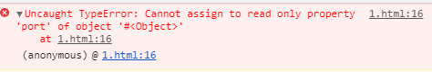

### js中有变量提升

```javascript
function hdw(){
    if(fals){
        var nams= "测试变量提升数据"
    }
    console.log(nams)
}
// 执行结果是 undefined
// 如果注释 var nams= "测试变量提升数据" 
//如果注释执行结果报错 Uncaught ReferenceError: nams is not defined
 
```

### TDZ

TDZ 又称暂时性死区，指变量在作用域内已经存在，但必须在`let/const`声明后才可以使用。

TDZ可以让程序保持先声明后使用的习惯，让程序更稳定。

- 变量要先声明后使用
- 建议使用let/const 而少使用var

### 全局污染

### 严格模式

```
"use strict"
```

### 变量锁定 Object.freeze

如果冻结变量后，变量也不可以修改了，使用严格模式会报出错误。

```javascript
"use strict"
const INFO = {
  url: 'https://www.houdunren.com',
  port: '8080'
};
Object.freeze(INFO); // 冻结变量
INFO.port = '443'; //修改了会报 Cannot assign to read only property
console.log(INFO);
```



### 传值与传址

基本类型复制是值的复制，互相不受影响。下例中将a变量的值赋值给b变量后，因为基本类型变量是独立的所以a的改变不会影响b变量的值。

```javascript
let a = 100;
let b = a;
a = 200;
console.log(b);
```

对于引用类型来讲，变量保存的是引用对象的指针。变量间赋值时其实赋值是变量的指针，这样多个变量就引用的是同一个对象。

```JavaScript
let a = {
  web: "后盾人"
};
let b = a;
a.web = "hdcms";
console.log(b);
```