### 背景渐变

##### 线性渐变

```css
							角度    颜色1  颜色2  颜色3
background: linear-gradient(to left,red,yellow,pink);

background: linear-gradient(30dug,red,yellow,pink);
```

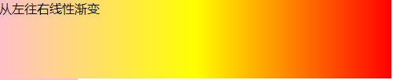

##### 径向渐变

```css
background: radial-gradient(50px 50px,red,yellow,pink);
							径向渐变的大小
```

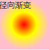

##### 标志位

```css
 background: linear-gradient(90deg, red 50%, pink 50%);
```

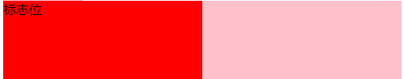

##### 中间点

```css
background: linear-gradient(90deg, red, 30%, pink);  /**进度条会用到**/
```

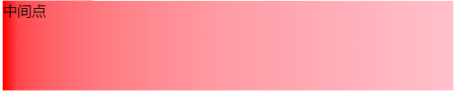

##### 重复线性渐变

```css
background: repeating-linear-gradient(45deg,blue,25px,yellow 25px, 25px,red 50px);
```


##### 重复径向渐变

```css
background:repeating-radial-gradient(100px 100px,red, yellow 25px, red 60px);
```

### after 和before 追加元素

```html
<h2>测试数据</h2>
<style>
    h2:before{
        content:"这是设置的文本";
        color:red;
    }
</style>
```


```html
<h2 data-title="这是加的文本">测试数据</h2>
<style>
    h2:before{
        content: attr(data-title);
        color:red;
    }
</style>
```

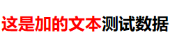

### 环绕距离控制

##### 

```html
<style>
   p span{
        width: 100px;
        height: 100px;
        float: left;
        background-color: blueviolet;
        margin: 10px;
        padding: 10px;
        border:1px solid red;
        shape-outside: margin-box; // 文本本环绕外边距
       	/**shape-outside: padding-box; 环绕内边距
       		shape-outside: content-box; 环绕文本
       		shape-outside: border-box; 环绕边线
       **/
    } 
</style>
<p><span></span>测试内容内容内容内容测试内容内容内容内容测试内容内容内容内容测试内容内容内容内容测试内容内容内容内容</p>
```

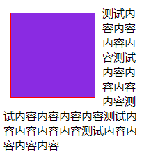

### 形状

#### 圆形

```html
<style>
   p span{
        width: 100px;
        height: 100px;
        float: left;
        background-color: blueviolet;
        margin: 10px;
        padding: 10px;
        border:1px solid red;
        shape-outside: margin-box;
       clip-path: circle(50%); /**圆形**/
    } 
</style>
<p><span></span>测试内容内容内容内容测试内容内容内容内容测试内容内容内容内容测试内容内容内容内容测试内容内容内容内容</p>
```

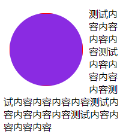

```css
clip-path: circle(50% at 0 100%);
```

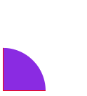

```css
clip-path: circle(50% at 50% 100%);
```

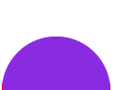

#### 椭圆

```css
clip-path: ellipse(20% 30%);
```

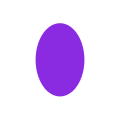

#### 矩形

```css
 clip-path: polygon(50% 0, 100% 100%,0 100%); //三角
```

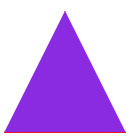

#### 文本围绕形状

```html
</style> 
p span{
        width: 100px;
        height: 100px;
        float: left;
        background-color: blueviolet;
        margin: 10px;
        padding: 10px;
        border:1px solid red;
        clip-path: polygon(50% 0, 100% 100%,0 100%);
        shape-outside: polygon(50% 0, 100% 100%,0 100%); <!--形状怎么写围绕就怎么写值-->
    }
    </style>
 <p><span></span>测试内容内容内容内容测试内容内容内容内容测试内容内容内容内容测试内容内容内容内容测试内容内容内容内容</p>
```

#### 围绕图片进行环绕

```html
<style>
 p img{
     float: left;
     shape-outside: url(01.png);
    }
</style>
<p>测试内容内容内容内容测试内容内容内容内容测试内容内容内容内容测试内容内容内容内容测试内容内容内容内容</p>
```

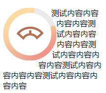

### 弹性布局

display:flex;行级元素

display: inline-flex;  块级元素

```css
flex-direction: row; 默认 左往右
flex-direction: row-reverse; 右往左
flex-direction:column; 上往下
flex-direction:column-reverse; 下往上

flex-wrap: wrap; 从上行下换行根据轴变化而变化
flex-wrap:wrap-reverse; 从下往上换行根据轴变化而变化

flex-direction和flex-wrap 可以写成一个
flex-flow: column wrap;

```

#### 主轴对齐

```css
flex-direction:row; 从左往右是主轴
justify-content:center; 主轴居中
值：
	flex-start 默认值项目位于容器的开头
	flex-end : 项目位于容器的结尾
	center ： 项目位于容器的中心
	space-between: 项目位于各行之间留有的空白的容器内 俩端对齐
	space-around：每个元素左右两端都有间距很少用
	space-evenly: 平均分布  有兼容问题  尽量不使用pc端
	
```

###### space-evenly有兼容问题解决方法

```css
/**如果我们在space-between的情况下添加两个宽度为0的伪类(n-1+2)，那么就等于是在用space-evenly布局(n+1)**/
container{
   display: flex;
   justify-content: space-between;
    /**justify-content: space-evenly;**/
}
container::before,
container::after{
  content: '';
  display: block;
}
```


#### 交叉轴

```css
align-items: strerch; 默认是从上往下
值：
	stretch: 默认值 拉长 不能设置高度
	center： 居中对齐
	flex-start: 容器的开始
	fles-end: 容器的结尾
	
```

#### 多行才有用align-content

```css
align-content: stretch;
值：
	stretch 默认值 拉伸 不能设置高度
	center 居中
	flex-start: 容器的开始
	fles-end: 容器的结尾
	space-between: 两端对齐
	space-around：每个元素左右两端都有间距很少用
	space-evenly: 平均分布
```

#### 对单个元素交叉轴的控制

```html
div div:first-child{
	align-self: center; //控制一个元素
}
```

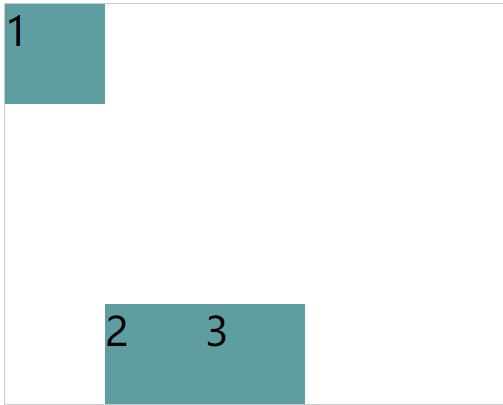

#### 元素平均分配

```
flex-grow:1; //可用的空间进行平均分配

```

#### flex-shrink

与 `flex-grow` 相反 `flex-shrink` 是在弹性盒子装不下元素时定义的缩小值。：

```text
缩小比例 = 不足的空间 / (元素 1 宽度 x 缩小比例) + (元素 2 宽度 x 缩小比例) ...
最终尺寸 = 元素三宽度 - (缩小比例 x  元素 3 的宽度) X 元素宽度
```

```css
 flex-shrink:0; /**都不缩小**/
```

####  flex-basis

flex-basis 属性定义了在分配多余空间之前，项目占据的主轴空间（main size）。浏览器根据这个属性，计算主轴是否有多余空间。

可以是长度单位，也可以是百分比。`flex-basis`的优先级高于`width、height`属性。

**优先级**

flex-basis 优先级大于 width、height。

#### flex 组合定义

flex是flex-grow、flex-shrink 、flex-basis缩写组合。

​	建议使用 flex 面不要单独使用 flex-grow / flew-shrink / flex-basis 。

#### order 改变元素的顺序

用于控制弹性元素的位置，默认为 `order:0` 数值越小越在前面，可以负数或整数。


## 栅格系统

```css
display: grid;
display: inline-grid;
```

#### 栅格行

```
grid-template-rows:100px 100px 100px;  //三行
// 三行 100px 上一句的简写
grid-template-rows:repeat(3, 100px);
// auto-fill自动填充多少行
grid-template-rows:repeat(auto-fill, 100px);
// 画三行 1fr是平均分布
grid-template-rows:repeat(3,1fr);
					// 平均占1份 平均占2份 平均占1份
grid-template-rows:1fr 2fr 1fr;
// minmax 最小高度50px 最大高度100px
grid-template-rows:repeat(3, minmax(50px,100px));
```


#### 栅格列

```
grid-template-column:100px 100px 100px;  //三列
// 三行 100px 上一句的简写
grid-template-column:repeat(3, 100px);
// auto-fill自动填充多少列
grid-template-column:repeat(auto-fill, 100px);
// 画三列 1fr是平均分布
grid-template-column:repeat(3,1fr);
				// 平均占1份 平均占2份 平均占1份
grid-template-column:1fr 2fr 1fr;
```

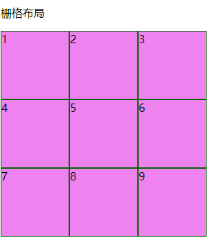

#### 栅格行间距

```css
row-gap:10px;
```

#### 栅格列间距

```css
column-gap:10px;
```

#### 栅格行和列间距合并

```css
gap:20px 20px; // 第一个参数是行 第二个参数是列
gap:20px; 行和列间距都是20px
```

#### 画给指定的格子中

```html
<style>
article{
            display: grid;
            height: 100px;
            grid-template-rows:repeat(3,1fr);
            grid-template-columns: repeat(3,1fr);
        }
        article div{
            background-color: violet;
            border:1px solid darkgreen;
            box-sizing: border-box;
            grid-row-start: 2; /**行的开始**/
            grid-column-start: 2;/**列的开始**/
            grid-row-end:2; /**行的结束**/
            grid-column-end: 2;/**列的结束**/
        }
</style>
<article>
  <div>1</div>
</article>
```

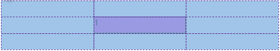

## 形状动画

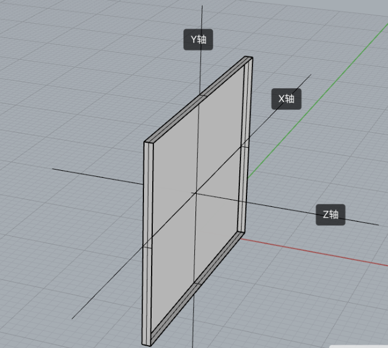

#### X轴和Y轴

```
transform: translateY(-100px);  //Y轴
transform: translateX(100px); // X轴
```


```css
 main div:nth-of-type(2){
   background-color:deeppink;
   transition: 2s;
}
main:hover div:nth-of-type(2){
   transform: translateX(200px) translateY(200px);
   /**和上面一样的效果**/
   transform: translate(200px,200px);
}
```

执行结果

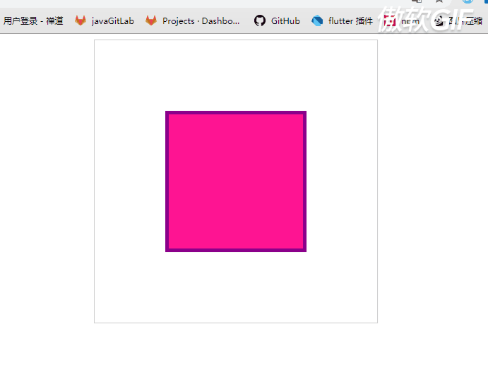

#### 控制三个轴

```
transform: translate3d(X轴,Y轴,Z轴);
```

#### 缩放

```
transform:scale(x,y);// 放大
transform:scaleX(x);// 放大
transform:scaleY(y);// 放大
```

#### 同时缩放三个轴

```
transform: scale3d(X轴,Y轴,Z轴);
```

#### 缩放基点

基点在左上角

```css
 transform-origin: left top;
//默认是基点是中间放大
```

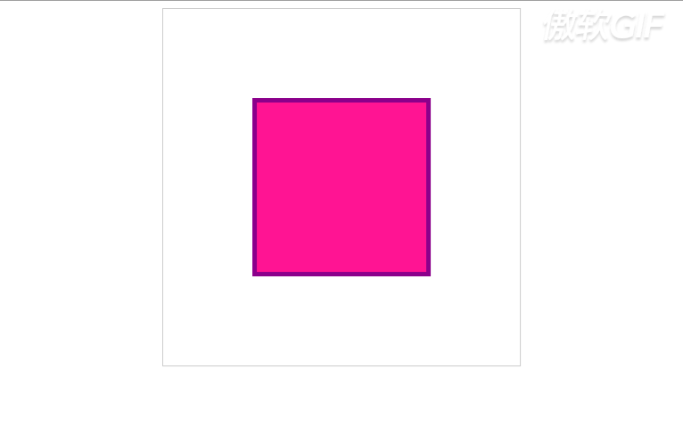

#### 旋转

```
transform:rotateX(90deg) //x轴旋转
transform:rotateY(90deg) //x轴旋转
transform:rotateZ(90deg)  //z轴旋转
transform:rotate(90deg)  //平面旋转
```

#### 控制三个轴旋转

```
transform:rotate3d(1,1,0,90deg)//x,Y轴旋转
transform:rotate3d(0,0,1,90deg) //z轴旋转
```

#### 倾斜

```
transform: skew(-45deg, 40deg); x轴和y轴倾斜
```

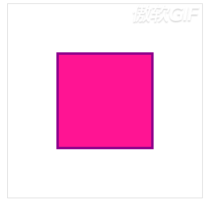

```
transform: skew(-45deg); x轴倾斜
```

