**rpm -qa |grep yum** 查看是否安装yum


docker就是一个一个的集装箱  打包成一个镜像

docker 是秒几   

docker 是一个极小的linux的环境

### docker 能干什么

1、容器虚拟化技术

2、开发/运维(DevOps)   一次构建 随处运行 


镜像/容器/仓库


### 安装方式

#### centOS 6.8安装 Docker

1. yum install -y epel-release

2. yum install -y docker-io

3. 安装后的配置文件： /etc/sysconfig/docker
4. 启动Docker后台服务 service docker start
5. docker version 验证

#### centOS 7 安装 Docker

[https://docs.docker.com/install/linux/docker-ee/centos/]: 参考手册

安装步骤

1. 安装所需的包。`yum-utils`提供了`yum-config-manager` 效用，并`device-mapper-persistent-data`和`lvm2`由需要 `devicemapper`存储驱动程序。

1. ```shell
   sudo yum install -y yum-utils \
     device-mapper-persistent-data \
     lvm2
   ```

2. 使用以下命令设置**稳定**存储库。

```shell
sudo yum-config-manager \
    --add-repo \
    https://download.docker.com/linux/centos/docker-ce.repo
```

3. **可选**：启用**夜间**或**测试**存储库。

这些存储库包含在`docker.repo`上面的文件中，但默认情况下处于禁用状态。您可以将它们与稳定存储库一起启用。以下命令启用**夜间**存储库。

```
sudo yum-config-manager --enable docker-ce-nightly
```

要启用**测试**通道，请运行以下命令：

```
sudo yum-config-manager --enable docker-ce-test
```

您可以通过运行带有标志的命令来禁用**每晚**或**测试**存储库 。要重新启用它，请使用该标志。以下命令禁用**夜间**存储库。`yum-config-manager``--disable``--enable`

```
sudo yum-config-manager --disable docker-ce-nightly
```

4. 安装*最新版本*的Docker CE和containerd，或者转到下一步安装特定版本：

```shell
sudo yum install docker-ce docker-ce-cli containerd.io
```

​    要安装*特定版本*的Docker CE，请在repo中列出可用版本，然后选择并安装：

```
yum list docker-ce --showduplicates | sort -r
```

5. 启动Docker。

```shell
 sudo systemctl start docker
```


### 安装docker 镜像

阿里云镜像加速器

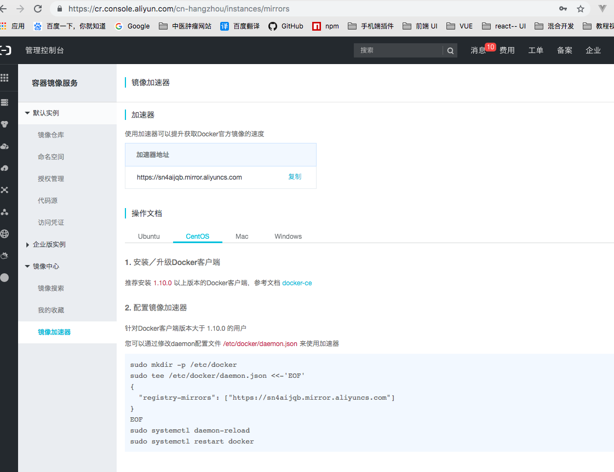


### centOS 6.8安装 镜像

打开

```
vim /etc/sysconfig/docker
```

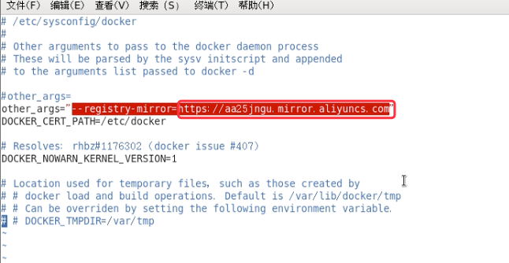

把地址替换成阿里云的镜像地址

在重启服务   service docker restart

检查镜像是否生效

ps -ef| grep docker

### centOS 7 安装镜像 

```
sudo vim /etc/docker/daemon.json
```

2. ```
   //粘贴到daemon.json里
   {
   "registry-mirrors": ["https://sn4aijqb.mirror.aliyuncs.com"]
   }
   ```

   ```
   //执行命令
   sudo systemctl daemon-reload
   sudo systemctl restart docker
   ```

   

### sudo docker run hello-world

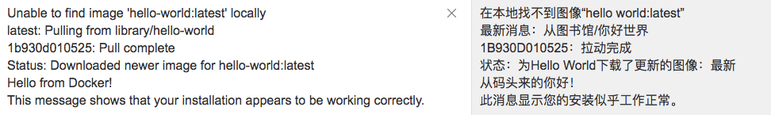

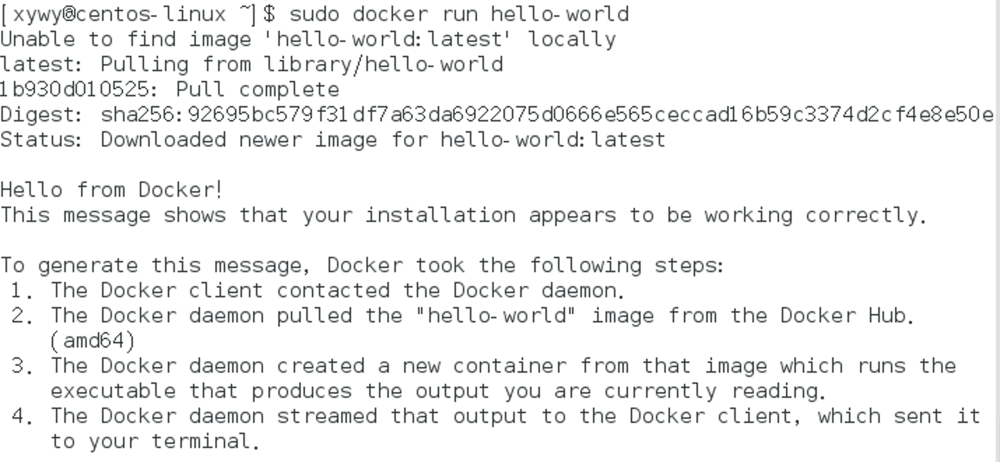


Docker 是一个Client-Server 结构的系统 Docker 守护进程运行在主机上，然后通过Socket连接从客户端访问 守护进程从客户端接收命令管理运行在主机上的容器 容器是一个运行时环境 就是我们前面说到的集装箱

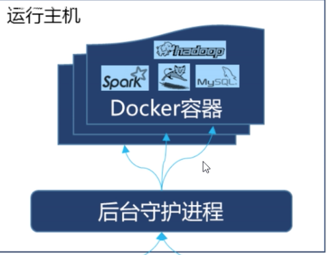


### 常用命令

#### 帮助命令

docker version     查看docker是否安装好

docker info     docker容器的描述

docker  —help   帮助命令 (重点)

#### 镜像命令

```shell
docker images     列出本地主机上的镜像
    -a    列出本地所有的镜像(含中间镜像层)     镜像是要分层的
	  -qa  显示本地镜像的id
    -- digests 显示摘要信息
    -- no-trunc
    
docker images  -a   列出本地所有的镜像
```

​	查询列出镜像里的包

```shell
docker search (tomcat)    //在docker hub上查询tomcat
		-s  30        获取点赞数和星数超过30的
docker search -s 30 tomcat  查询点赞数和星数超过30的 tomcat

```

   现在镜像

```
docker pull (tomcat)  不写版本自动获取最新版本

```

删除镜像

```
docker rmi 要删除的包
例如
docker rmi tomcat

删除单个
docker rmi -f 镜像ID(或者唯一镜像名)
		-f  是强制删除
删除多个
docker rmi -f  镜像id1  镜像id2  镜像id3

删除全部
docker rmi -f $(docker images -qa)
```

#### 启动交互式容器命令

有镜像才能创建容器， 这是根本前提(下载一个centos镜像演示)


新建并启动容器    docker run [options] 镜像(重点)    本地有就启动 本地没有就去远程拉取

options 可选参数有

​		-i  以交互模式运行容器  通常与 -t 同时使用

​		-t  为容器重新分配 一个伪输入终端 通常与 -i 同时使用

​		-d   后台运行容器 并返回容器ID  也即启动守护式容器

​		-P 随机端口映射

​		-p 指定端口映射有以下4种模式

​				ip:hostPort:containerPort

​				ip::containerPort

​				hostPort:containerPort

​				containerPort

#### 

```
docker run -it 容器id      
```

```
//给centos 容器一个别名为 mucentos   不设置就自动设置一个随机的名字
docker run -it --name mucentos centos
```

#### 后台方式启动容器

```
docker run -d -p 6666：8080 tomcat
```

#### 前台方式启动容器

```
docker run -it -p 8888:8080 tomcat
```


  查看进程

​		ps -df

#### 列出所有**正在**运行的容器

查看docker的进程

docker  ps [OPTIONS] 常用

   -a：   列出当前所有正在运行的容器 + 历史上运行过得

​	-l ：  上一次运行的

​	-n  3 ： 上3次运行的

​	-q: 静默模式，只显示容器编号。

​	-lq ：显示容器id


#### 退出容器 

两种退出方式

```shell
exit    容器停止退出
ctrl+p+q   容器不停止退出

```

#### 容器停后在启动


用  CONTAINER ID  重启已经关闭的容器

```shell
docker start 这里的容器id例如（6bf0cbf9f6e8）
```

启动成功就返回对应的容器编号 ID

#### 停止容器

慢慢的停止

```
docker stop  容器id或者容器名
```

查看停止的容器用

docker ps -n 5


#### 强制停止

例如 把家里的冰箱的电源拔掉一样 粗暴一些

```
docker kill 容器id或者容器名
```

#### 删除已停止的容器

```
docker rm 容器id或者容器名
```

没有停止的容器就加 -f

```
docker rm -f 容器id或者容器名
```

#### 一次性删除多个容器

```shell
docker rm -f $(docker ps -a -q)

```


#### (重点)启动守护试容器

docker run -d （容器名称）例如

```sherll
docker run -d centos
```

启动后如果没有命令挂起就会自动退出

 docker ps 查看不到进程


#### 查看容器日志

docker logs 容器id

docker logs -f -t   容器id

只看倒数的3行

​		docker logs -f -t  --tail 3  容器id

#### 查看容器内运行的进程

docker top  容器id


#### 查看容器的细节

docker inspect 容器id


#### 进入容器按了ctrl+p+q  然后在进入容器命令

重新进入容器

docker attach 容器id

在父极上执行容器命令  

docker exec  -t 容器id   ls -l

####  从容器内拷贝到主机上

docker cp 容器id:容器路径  主机目录


## docker 镜像


镜像是一种轻量级、可执行的独立软件包，用来打包软件运行环境和基于运行环境开发的软件，它包含运行某个软件所需的所有内容，包括代码、运行时、库、环境变量和配置文件。

镜像是什么 是 联合文件系统


#### 指定端口访问服务器

-p是自己指定端口

docker run -it -p 8888:8080 tomcat

-P是自动分配端口

docker run -it -P tomcat


#### 把已存在的镜像形成一个新的镜像

```
docker commit -m="提交的描述信息" -a="作者"  容器id  要镜像的名称(自定义):版本号
//例如
docker commit -m="tomcat without docs" -a="yubo" 5a069ba3df4d atguigu/mytomcat:1.2
```

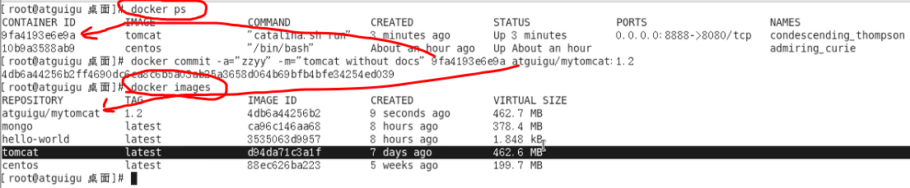


## docker 容器数据卷

 容器数据卷就是 docker 里面的 rdb和aof文件只要是干**数据共享和数据持久化**的工作

命令

```
docker run -it -v 宿主机的绝对目录：容器内的目录 镜像名 
```

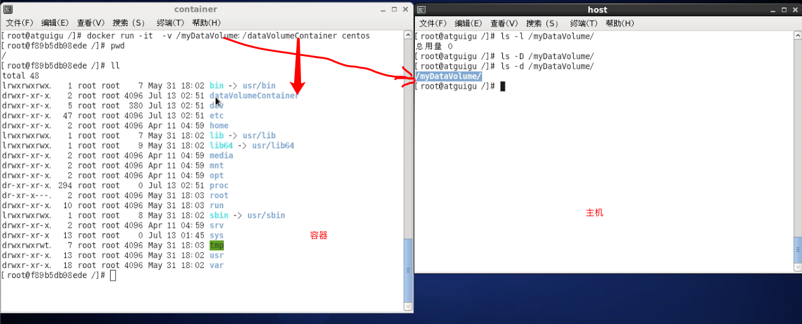

查看容器和主机创建的文件夹是否关联

```sherll
docker inspect 容器id
```

查看是否主机和宿主机是否挂载成功

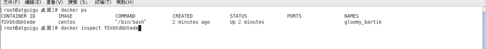


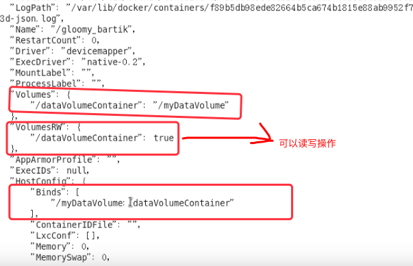

主机和宿主机之间可以同步

容器停止退出后 主机修改后数据是否同   是同步的


#### 命令带权限

```
//or 是带权限的
docker run -it  -v 宿主机的绝对目录：容器内的目录:or 镜像名 
```

容器不能写入  容器只能查看  主机可以创建修改  

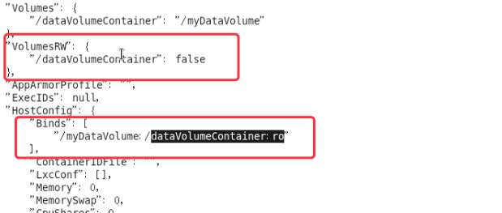

#### docker File 添加卷

使用docker file方式添加卷(创建文件夹)

1、主机上新建 mydocker文件夹 并进入

```
mkeir /mydocker
```

2、然后vim Dockefile

```
vim Dockefile
```

3、在Dockefile里加入 添加两个容器数据卷doatVolumeContainer1 和 doatVolumeContainer2

```
#volume test
FORM centos
VOLUME ["/doatVolumeContainer1","/doatVolumeContainer2"]
CMD echo "finished, ------------success"
CMD /bin/bash

```

4、执行构建镜像

```
docker build -f /mydocker/Dockefile -t 自定义名称 .
例如
docker build -f /mydocker/Dockefile -t zzyy/centos .
```

5、在运行容器

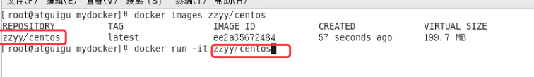


6、查看主机主机上的创建的容器卷

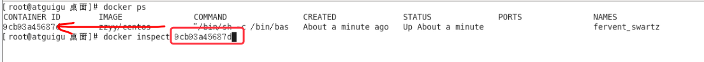

```
docker inspect 容器id
```

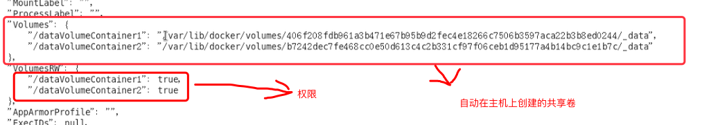


#### 继承共享父到子子到父继承

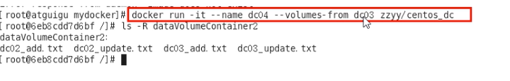

```shell
docker run -it --name doc01 zzyy/centos     //1号几
```

2、二号机继承一号机

```shell
docker run -it --name doc02  --volumes-from doc01 zzyy/centos   //2号机
```

3、三号机 继承二号机

```shell
docker run -it --name doc03  --volumes-from doc02 zzyy/centos
```

他们都是数据更新  删除了一号机    2号机和3号机共享的数据都还在

zzyy/centos  共享目录是    doatVolumeContainer1 和 doatVolumeContainer2

结论 ： 容器之间配置信息的传递 数据卷的生命周期一直持续到没有容器使用它为止


## docker File详细

#### 三步骤

1、手动编写一个dockerfile文件 当然必须符合file的规范

2、有这个文件后 ，直接docker build 命令执行 获得一个自定义的镜像

3、docker run -it 镜像名


#### docker file 内容基础知识

1、每条保留字指令都必须为大写字母 且后面要跟随至少一个参数

2、指令按照从上到下，顺序执行

3、# 表示注释

4、每条指令都会创建一个新的镜像层，并对镜像进行提交

#### docker file 体系结构

FROM                     基础镜像 当前镜像属于哪个镜像

MAINTAINER			镜像维护者姓名和邮箱

RUN							容器构建时需要运行的命令

EXPOSE					当前容器对外暴露出的端口

WORKDIR				指定在创建容器后 终端默认登陆进来工作目录 一个落脚点 默认根目录

ENV								

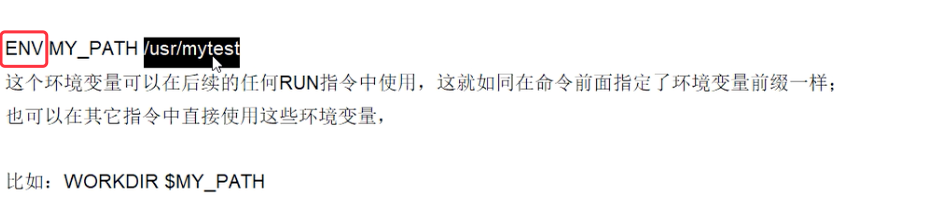

ADD			（拷贝加解压缩）将宿主机目录下的文件拷贝进镜像且ADD 命令会自动处理url和解压tar压缩包

COPY				（只拷贝） 拷贝文件和目录到镜像中

```
//两种写法
COPY 目录1 要拷贝到什么目录
COPY ["src","dest"]
```

VOLUME			容器数据卷 用于数据保存和持久化工作	

CMD				

​		1、指定一个容器启动时要运行的命令

​		2、dockerfile 中可以有多个CMD指令 但只有最后一个生效  CMD会被docker run 之后的参数替换

ENTRYPOINT

​		1、指定一个容器启动时要运行的命令

​		2、ENTRYPOINT的目的和CMD 一样 都是在指定容器启动程序及参数

ONBUILD		当构建一个被继承的dockerfile 时运行命令  父镜像在被子继承后父镜像的onbuild 被触发

执行构建镜像

在主机上创建 /mydocker/目录

```
// 在目录里执行
vim Dockefile2    

//把下面的内容放入Dockefile2中
```


```shell
FROM centos
MAINTAINER zzyy<123456@163.com>

EVN MYPATH /usr/local
WORKIDR $MYPATH

RUN yum -y install vim   #安装vim

# 导出端口
EXPOSE 80

CMD echo "success -----------ok"
CMD  /bin/bash
```

构建Dockefile2

```
docker build -f /mydocker/Dockefile2 -t 自定义名称 .
例如
docker build -f /mydocker/Dockefile2 -t zzyy/centos .
```

运行容器

```
docker run -it   //镜像id名称
//例如
docker run -it  zzyy/centos
```


## 卸载docker

systemctl stop docker      //停止docker服务

yum -y remover docker    //删除docker

rm -rf /var/lib/docker		//删除

