## 开源监控系统有三种

1、Nagios

2、Cacti

3、Zabbix


企业级Zabbix 

   1、所有监控配置都web化，采用php开发

   2、支持分布式监控

   3、支持多种方式数据采集：简单监控、Agent监控、snmp接口监控、JMX接口监控

   4、警告配置 web化 邮件、微信、钉钉、短信

​	5、Zabbix和Grafana 的结合方便监控数据的可视化

​	6、先搭建zabbix 在实战中zabbix


#### 搭建Nginx

nginx 官网http://nginx.org/en/download.html

线上用    Stable version


编译安装脚本

```shell
 yum install -y wget gcc  gcc-c++ make pcre pcer-devel zilb-devel openssl openssl-devel
```

上传下载 包 

```shell
yum install lrzsz -y
```

把nginx 安装到 /usr/loacl/src

```shell
cd  /usr/local/src
```

下载nginx包

```shell
wget 'http://nginx.org/download/nginx-1.16.0.tar.gz'
```

解压包

```shell
tar -zxvf  nginx-1.16.0.tar.gz
```

```shell
cd nginx-1.16.0.tar.gz
```

```shell
./configure --prefix=/usr/local/nginx
```

```
make && make install
```

#### 生成四个文件

conf   配置文件

 html 	放网站的

 logs    日志文件

 sbin    二进制文件

输出centos 的环境变量

echo $PATH

#### nginx 手动启动和关闭

```
vim /etc/profile
```

把  export PATH=$PATH:/usr/local/nginx/sbin添加到profile文件里

​    1、环境变量：export   PATH=$PATH:/usr/local/nginx/sbin

```
source /etc/profile    //刷新一下
```

​	2、检查nginx配置 文件是否正确： nginx -t

​	3、启动nginx ： nginx

​	4、关闭nginx： nginx -s stop

查看nginx服务是否启动

```
ps auxfww|grep nginx
```

查看nginx端口

```
netstat -tulnp|grep nginx
```

### 使用systemctl管理nginx 

```
vim /usr/lib/systemd/system/nginx.service
```

```
[Unit]
Description=nginx
After=network-online.target remote-fs.target nss-lookup.target
Wants=network-online.target
[Service]
Type=forking
ExecStart=/usr/local/nginx/sbin/nginx
[Install]
WantedBy=multi-user.target
```

wq保存退出，执行如下命令生效 

```
systemctl daemon-reload
```

启动

```
systemctl start nginx
```

关闭

```
systemctl stop nginx
```

重启

```
systemctl restart nginx
```

加入开机启动

```
systemctl enable nginx
```

取消开机启动

```
 systemctl disable nginx
```

### php编译安装

安装依赖

```shell
yum -y install epel-release
yum install gcc++ gcc-c++ gcc bison bison-devel zlib zlib-devel libmcrypt libmcrypt-devel mcrypt mhash-devel openssl-devel libxml2-devel libcurl-devel bzip2-devel readline-devel libedit-devel sqlite-devel jemalloc jemalloc-devel pcre pcre-devel freetype freetype-devel openldap openldap-devel libxml2 libxml2-devel
 
```

```
cd /usr/local/src/
```

```
wget http://cn2.php.net/distributions/php-5.6.40.tar.gz
```

```
tar zvxf php-5.6.30.tar.gz
```

```
cd php-5.6.30
```


```
./configure --prefix=/usr/local/php \
--with-config-file-path=/usr/local/php/etc \
--enable-inline-optimization --disable-debug \
--disable-rpath --enable-shared --enable-opcache \
--enable-fpm --with-fpm-user=www \
--with-fpm-group=www \
--with-mysql=mysqlnd \
--with-mysqli=mysqlnd \
--with-pdo-mysql=mysqlnd \
--with-gettext \
--enable-mbstring \
--with-iconv \
--with-mcrypt \
--with-mhash \
--with-openssl \
--enable-bcmath \
--enable-soap \
--with-libxml-dir \
--enable-pcntl \
--enable-shmop \
--enable-sysvmsg \
--enable-sysvsem \
--enable-sysvshm \
--enable-sockets \
--with-curl --with-zlib \
--enable-zip \
--with-bz2 \
--with-readline –with-jpeg-dir –with-freetype-dir --with-freetype-dir --with-jpeg-dir --with-png-dir --with-gd --with-zlib
```

```
make && make install
```

创建用户

```
useradd -s /sbin/nologin www
```

默认没有配置文件

cp php.ini-production /usr/local/php/etc/php.ini

启动php-fpm

​	环境变量

```
vim /etc/profile   //加入下面一行
```

export  PATH=$PATH:/usr/local/php/sbin:/usr/local/php/bin/

检查配置文件命令

```
php-fpm -t
```

在/usr/local/php/etc目录下执行命令

```
cp php-fpm.conf.default php-fpm.conf
```

php-fpm 两种方式

​      1、Socket（）

​	  2、网络的方式


#### 使用systemctl管理php-fpm

```shell
vim /usr/lib/systemd/system/php-fpm.service
```

```shell
[Unit]
Description=php-fpm 
After=syslog.target network.target
Wants=network-online.target
[Service]
Type=forking
ExecStart=/usr/local/php/sbin/php-fpm
[Install]
WantedBy=multi-user.target
```

这个生效  上面一个不生效

```
[Unit]
Description=php-fpm
After=network.target
[Service]
Type=forking
ExecStart=/usr/local/php/sbin/php-fpm
ExecStop=/bin/pkill -9 php-fpm
PrivateTmp=true
[Install]
WantedBy=multi-user.target
```

wq保存退出，执行如下命令生效 

```
systemctl daemon-reload
```

启动服务

```
systemctl start php-fpm
```

检查php是否启动成功

```
ps -ef|grep php
```

如果不生效就杀死进程

```
killall -9 php-fpm
```

nginx 默认不解析php

#### 列出php 的os

```
/usr/local/php/bin/php -m
```

查询php.ini的位置

```
php --ini
```


##  源码编译安装

mysql官网  www.mysql.com

下载 GPL 免费版本

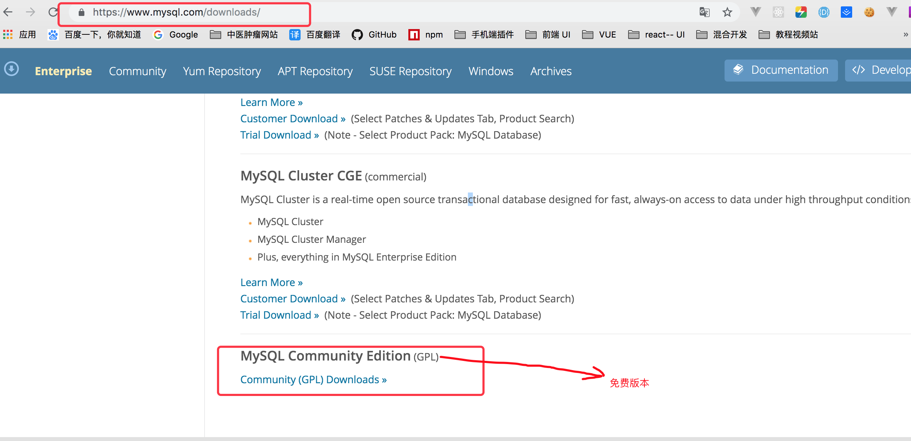

下载mysql Community server GPL

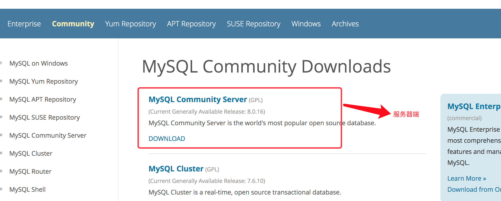

选择版本

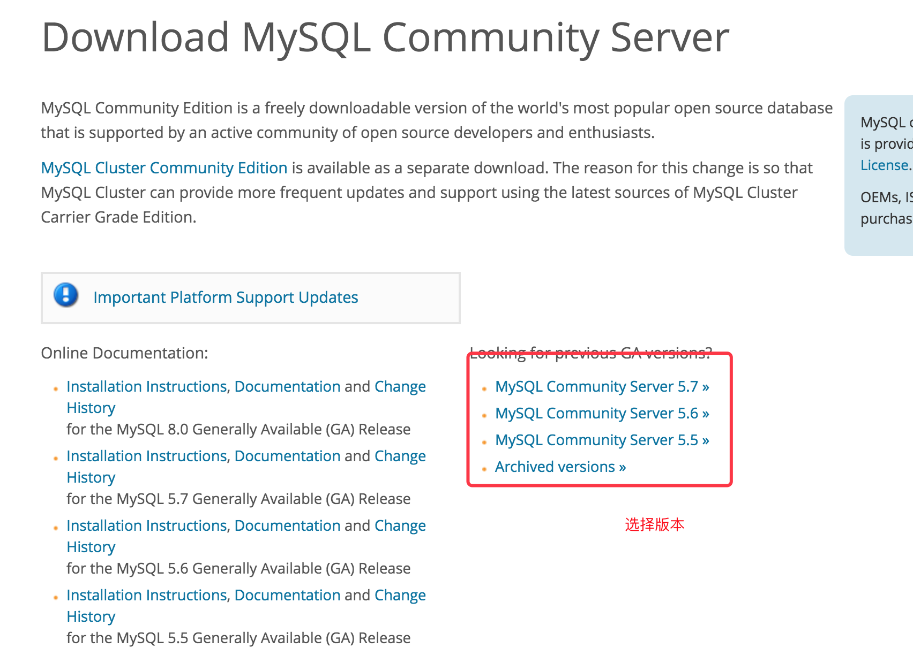

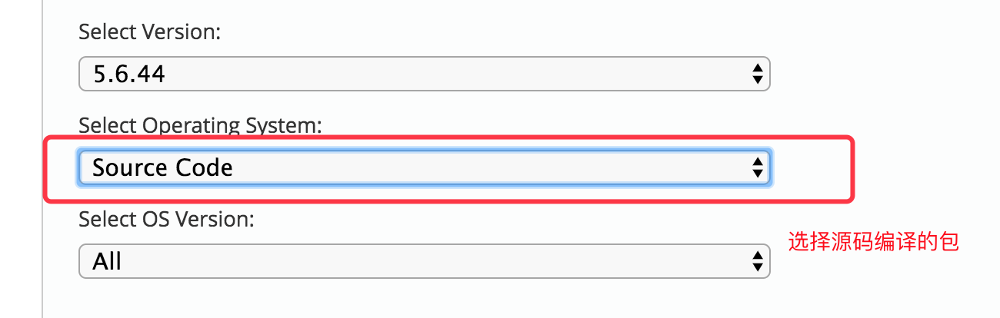

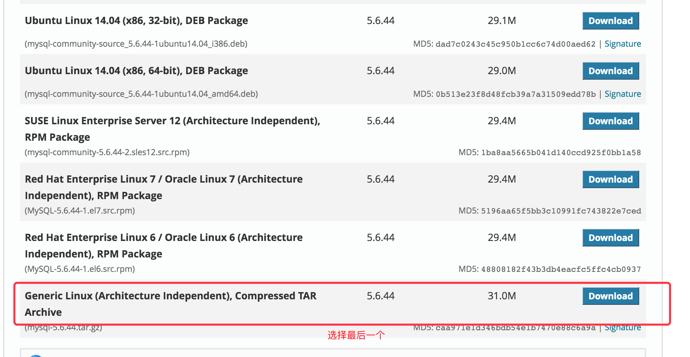

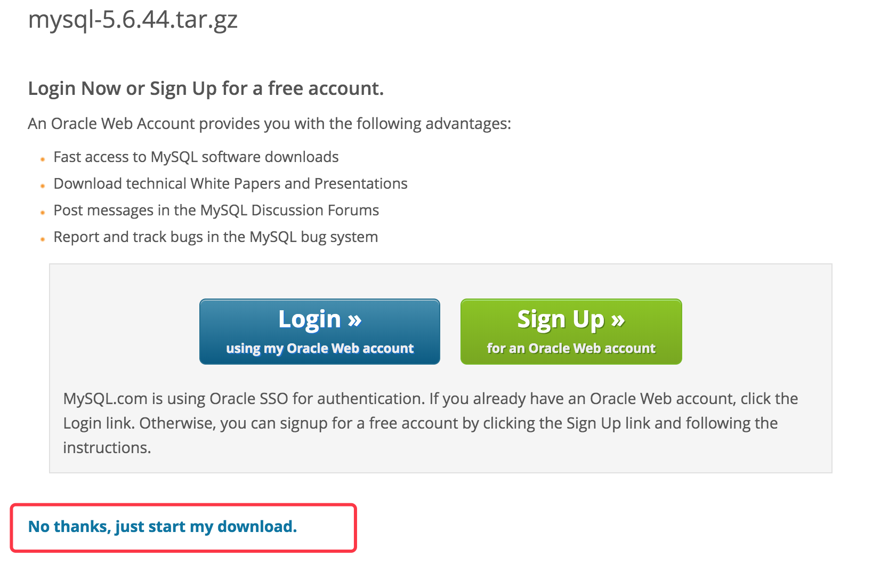

### 安装mysql依赖

检查 是否安装了mysql

```
rpm -qa | grep mysql
```

```
yum install -y gcc gcc-c++ make tar openssl openssl-devel cmake ncurses ncurses-devel 
```

新建一个mysql用户

```
useradd -s /sbin/nologin mysql

cd /usr/local/src

wget 'https://dev.mysql.com/get/Downloads/MySQL-5.6/mysql-5.6.44.tar.gz'
```

解压

```
tar -zxvf mysql-5.6.44.tar.gz
```

编译安装

```

cmake -DCMAKE_INSTALL_PREFIX=/usr/local/mysql -DMYSQL_DATADIR=/data/mysql -DDEFAULT_CHARSET=utf8 -DDEFAULT_COLLATION=utf8_general_ci -DWITH_EXTRA_CHARSETS:STRING=all -DWITH_DEBUG=0 -DWITH_SSL=yes -DWITH_READLINE=1 -DENABLED_LOCAL_INFILE=1 
```

DCMAKE_INSTALL_PREFIX            mysql安装目录

DMYSQL_DATADIR                         数据目录


```
make && make install
```

修改配置文件地址

```
cp support-files/mysql.server /etc/init.d/mysqld
```

```
chmod a+x /etc/init.d/mysqld
```

设置环境变量

```
vim /etc/profile   //加入下面一行
```

```
export  PATH=$PATH:/usr/local/mysql/bin/
```

```
source  /etc/profile
```

####  启动mysql

​		更新mysql配置 /etc/my.cnf

```
 vim /etc/my.cnf
```

把下面的内容替换到/etc/my.cnf中

```
[mysqld]
bind-address=127.0.0.1
port=3306
datadir=/data/mysql
user=mysql
skip-name-resolve
long_query_time=2
slow_query_log_file=/data/mysql/mysql-slow.log
expire_logs_days=2
innodb-file-per-table=1
innodb_flush_log_at_trx_commit = 2
log_warnings=1
max_allowed_packet= 512M
connect_timeout = 60
net_read_timeout = 120
[mysqld_safe]
log-error=/data/mysql/mysqld.log
pid-file=/data/mysql/mysqld.pid

```

mysql 数据库初始化

```
mkdir -pv /data/mysql
```

```
chown -R mysql:mysql /usr/local/mysql /data/mysql/
```

```
yum install -y perl-Module-Install
```

```
/usr/local/mysql/scripts/mysql_install_db --basedir=/usr/local/mysql/ --user=mysql --datadir=/data/mysql/
```

使用 systemctl 管理 mysql

```
vim /usr/lib/systemd/system/mysqld.service
```

```
[Unit]
Description=mysqld
After=network.target 
[Service]
Type=forking
ExecStart=/etc/init.d/mysqld start
[Install]
WantedBy=multi-user.target
```

启动mysql

wq保存退出，执行如下命令生效 

```
systemctl daemon-reload
```

启动服务

```
systemctl start mysqld
```

查看进程

```
ps auxf|grep mysql
```

查看监听的端口

```
netstat -tulnp|grep mysql
```

#### mysql的安全

访问mysql

```
mysql -uroot -h 127.0.0.1 -A
```

设置mysql加密码

```
cd /data/mysql/
```

```
mysqladmin -h 127.0.0.1 -u root password 'root'   //这里写密码
```

```
mysql -uroot -h 127.0.0.1 -p密码 -A
```

### 限制ip登陆

授权ip登陆

- 要求用户 'username'，使用密码 'password' 可以从任何主机连接到mysql服务器

```
GRANT ALL PRIVILEGES ON *.* TO 'username'@'%' IDENTIFIED BY 'password' WITH GRANT OPTION;

 FLUSH PRIVILEGES;
```

- 要求仅允许IP为192.168.0.1使用用户名 'username'，密码 'password'连接到mysq

```
GRANT ALL PRIVILEGES ON *.* TO 'username'@'192.168.0.1' IDENTIFIED BY 'password' WITH GRANT OPTION;

FLUSH PRIVILEGES;
```

- 要求仅允许IP为192.168.0.1使用用户名 'username'，密码 'password'连接到mysql服务器的dbname数据库

```
GRANT ALL PRIVILEGES ON dbname.* TO 'username'@'192.168.0.1' IDENTIFIED BY 'password' WITH GRANT OPTION;

FLUSH PRIVILEGES;
```


# ZABBIX 编译安装

ZABBIX 地址 https://www.zabbix.com/download_sources

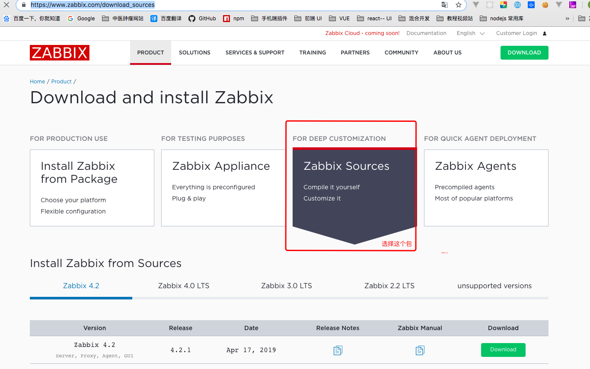


```
yum install -y libevent-devel wget tar gcc gcc-c++ make net-snmp-devel libxml2-devel libcurl-devel
```

```
useradd -s /sbin/nologin  zabbix 
```

```
cd /usr/local/src/
```

```
wget 'https://sourceforge.net/projects/zabbix/files/ZABBIX%20Latest%20Stable/4.0.7/zabbix-4.0.7.tar.gz'
```

```
tar -zxvf zabbix-4.2.1.tar.gz
```

```
cd zabbix-4.2.1
```

 

```
./configure --prefix=/usr/local/zabbix --enable-server --enable-agent --with-mysql=/usr/local/mysql/bin/mysql_config --with-net-snmp --with-libcurl --with-libxml2
```

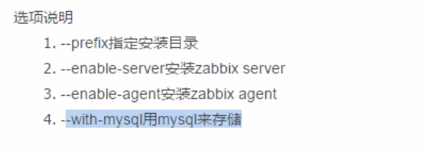

```
make && make install
```

#### 设置环境变量

```
vim /etc/profile   //加入下面一行
```

```
export PATH=$PATH:/usr/local/zabbix/sbin/:/usr/local/zabbix/bin/
```


```
source  /etc/profile
```

查看版本

```
zabbix_server --version
```

**设置开启自动启动**

```
vim /etc/rc.d/rc.local  最后添加下面两行
```

```
/usr/local/zabbix/sbin/zabbix_server start
/usr/local/zabbix/sbin/zabbix_agentd start
```

####zabbix启动

需要到mysql里做数据库初始化

先登录mysql

```
mysql -uroot -h 127.0.0.1 -p密码 
```

执行命令

```
create database zabbix character set utf8 collate utf8_bin;
```

数据的所有权限给 zabbix

```
GRANT ALL PRIVILEGES ON zabbix.* TO zabbix@'127.0.0.1' IDENTIFIED BY 'root';
```

权限刷新

```
FLUSH PRIVILEGES;
```

zabbix 连接数据库

```
mysql -uzabbix -h 127.0.0.1 -proot
```

在mysql执行编码设置UTF-8

```
set names utf8;
```

进入数据库

```
use zabbix
```

zabbix 数据初始化 执行 3个sql

```
source /usr/local/src/zabbix-4.2.1/database/mysql/schema.sql;
source /usr/local/src/zabbix-4.2.1/database/mysql/data.sql;
source /usr/local/src/zabbix-4.2.1/database/mysql/images.sql;
```

#### zabbix 配置文件

```
vim /usr/local/zabbix/etc/zabbix_server.conf   //把数据都删除
```

```
LogFile=/usr/local/zabbix/zabbix_server.log
DBHost=127.0.0.1
DBName=zabbix
DBUser=zabbix
DBPassword=root
DBPort=3306
Timeout=30
AlertScriptsPath=/usr/local/zabbix/alertscripts 
ExternalScripts=/usr/local/zabbix/externalscripts
LogSlowQueries=3000
```

启动

```
chown zabbix:zabbix -R /usr/local/zabbix/
```

```
zabbix_server
```

查看端口是否监听

```
netstat -tulnp|grep zabbix
```

检查php是否启动成功

```
ps -ef|grep zabbix
```

错误1

```
zabbix_server [11923]: Is this process already running? Could not lock PID file [/tmp/zabbix_server.pid]: [11] Resource temporarily unavailable
```

解决方法

```
//先杀死进程
pkill zabbix

ps ax | grep zabbix_agentd
//在重启
```


### zabbix web的安装

```
mkdir /usr/loacl/nginx/html/zabbix

cp -a /usr/loacl/src/zabbix-4.0.7/frontends/php/* /usr/loacl/nginx/html/zabbix/
```

修改配置文件

```
vim /usr/local/php/etc/php.ini
```

1、post_max_size = 16M

2、 max_execution_time = 300

3、max_input_time=300

4、date.timezone = Asia/Shanghai

5、always_populate_raw_post_data = -1

重启服务器 

```
systemctl restart php-fpm
```

### 默认用户名

1、默认用户名 Admin 密码 zabbix

2、禁用Zabbix server 主机的监控

3、禁用guest用户

4、修改Admin的密码 

## zabbix 添加监控

1、ping检测 存活和丢包检测 

```
yum install epel-release

yum install fping -y
```

2、检查tcp端口22

3、查看监控


### 使用模板


### 短信 邮件 钉钉 通知

脚本文件位置

AlertScriptsPath=/usr/local/zabbix/alertscripts 

创建位置

```
mkdir /usr/local/zabbix/alertscripts 
```


配置邮件告警

 有两种

 1、一种是未加密的 25端口 例如 qq邮箱  163邮箱等等

 2、是465加密端口 (建议用这个)

#### 申请邮箱的授权码


##### 写邮箱的python的脚本

​		查看python 的位置

```
which python
```

```shell
#!/usr/bin/python
# -*- coding: utf-8 -*- 
from email.mime.text import MIMEText
from email.header import Header
from smtplib import SMTP_SSL
import sys 
smtpaddr ='smtp.qq.com'
#邮箱地址
myemail = '342730241@qq.com'
#密码
password =  'osyshoerwanubgbc' 
recvmail=sys.argv[1]
subject = sys.argv[2]
content=sys.argv[3]
msg = MIMEText("""%s"""%(content),'plain','utf-8')
msg['Subject']=Header(subject,'utf-8').encode()
msg['From']=myemail
msg['To']=recvmail
try:
	smtp = SMTP_SSL(smtpaddr)
	smtp.login(myemail, password)
##可以发送多个邮箱
	smtp.sendmail(myemail,recvmail.split(','),msg.as_string())
	smtp.quit()
	print('success')
except Exception as e:
	print('fail'+ str(e))
```

新建脚本

```
vim /usr/local/zabbix/alertscripts/zabbix_sendmail.py
```

```
cd /usr/local/zabbix/alertscripts/
```

加执行权限   执行

```
chmod a+x zabbix_sendmail.py
```

测试脚本文件 成功返回 success

```
/usr/local/zabbix/alertscripts/zabbix_sendmail.py 342730241@qq.com 'zabbix disk' 'disk is not enough'
```

##### 定义脚本的方法

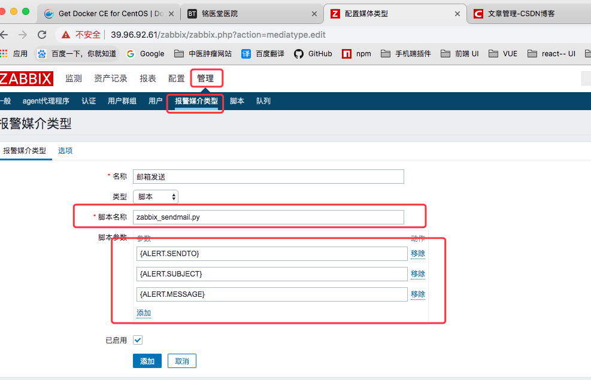

使用方法

1、

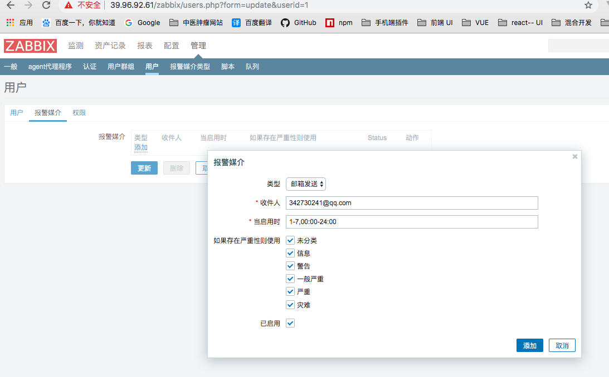

2、

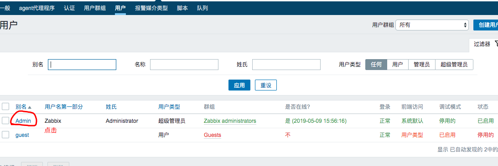

3、


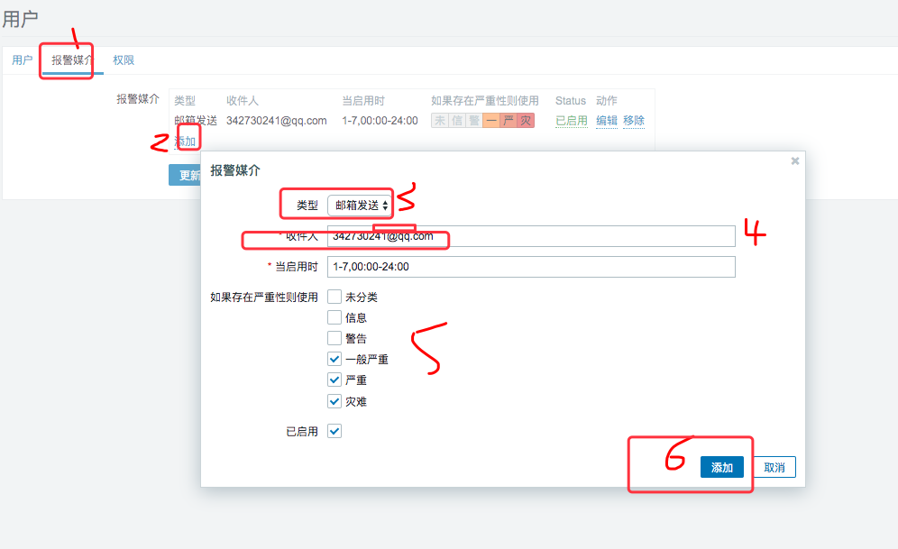

4、


5、

